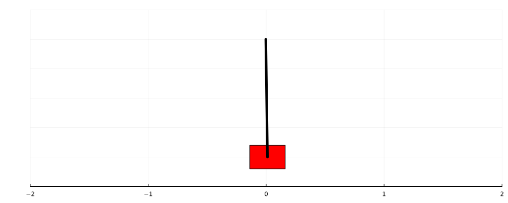

# Machine learning experiments in Julia

I wrote this code for my own edification and for my portfolio. The main goal was to create very clear implementations of an MLP, forward propagation, backward propagation and an actor-critic training algorithm.

I also wanted to write up a throrough derivation of the back propagation algorithm. That derivation is provided below in the [back propagation](#loss-function) section.

## Install package dependencies
```julia
import Pkg; Pkg.add("Plots")
```

## Cartpole

Use the actor-critic algorithm to train an MLP on a cartpole environment and then render an animation:
```julia
include("src/demo/cartpole_actor_critic.jl");
actor_network = train_cartpole(1e5);
render_cartpole(actor_network, 200)
```

After 10000 training iterations:


After 1000000 training iterations:


## Definitions and notation

1. A Multilayer Perceptron (MLP) is a type of neural network with certain evaluation rules.

1. An MLP contains $L$ layers and $W=L-1$ sets of weights.

1. Each layer is a vector of real numbers. We represent the $i^{\text{th}}$ element of the $k^{\text{th}}$ layer as $l_i^{(k)}$. The length (number of neurons) of a layer is given by $|l_i^{(k)}|$.

1. Each set of weights is a matrix of real numbers. We represent the $(i,j)^{\text{th}}$ element of the $k^{\text{th}}$ set of weights as $w_{ij}^{(k)}$.

1. For simplified computation biases are integrated into the weight matrices. This is accomplished by adding a zeroth column to each weight matrix that contains the biases associated with the corresponding layer. Additionally a zeroth element is added to each layer vector that's always equal to 1. Specifically, for all $1 \le m \le L$ and $1 \le n \le W$ we have 
$$l_0^{(m)} = 1$$
$$w_{i0}^{(n)} = b_i$$

## 2-layer perceptron forward propagation

The simplest MLP we can have contains just 2 layers and 1 set of weights. Given the first layer (inputs), we compute the values of the second layer via

$$l_i^{(2)} = \sum_{j=0}^{|l^{(1)}|} w^{(1)}_{ij} l^{(1)}_j$$

Note that the sum starts at $j=0$. This is a result of the integrated bias mechanism described above.

We could also represent this expression as matrix-vector multplication. For example, $l^{(2)} = W^{(1)} l^{(1)}$. But despite looking simpler, this representation is more difficult to work with than the element-wise representation.

## MLP forward propagation

For a general MLP the values of the hidden layers are computed by applying an activation function $\mathcal{A}$:

### Hidden layers: $2 \le k \le L-1$

$$l_i^{(k)} = \mathcal{A} \left( \sum_{j=0}^{|l^{(k-1)}|} w^{(k-1)}_{ij} l^{(k-1)}_j \right)$$

### $L^{th}$ layer (output layer)

The outputs are computed without applying an activation function:

$$l_i^{(L)} = \sum_{j=0}^{|l^{(L-1)}|} w^{(L-1)}_{ij} l^{(L-1)}_j$$

 For certain training algorithms, however, other functions are applied to the last outputs. For example, the `softmax()` function is used to convert the outputs to a set of probabilities.

### Code

The forward propagation algorithm is implemented in `propagate.jl`:
```
layers[1].values .= inputs

for i in 2:lastindex(layers)-1
    layers[i].values .= weights[i-1].values_with_bias * layers[i-1].values_with_bias
    layers[i].values .= propagator.activation.(layers[i].values)
end

layers[end].values .= weights[end].values_with_bias * layers[end-1].values_with_bias
```

### Forward propagation as single function

The expressions above define a recurrence relation that can be combined to to express the values of the last layer as a function of the first layer (and all the weights):

$$
\begin{align*} 
l_i^{(L)} &= \sum_{j=0}^{|l^{L-1}|} w_{ij}^{(L-1)} l_j^{L-1} \\
%
&= \sum_{j=0}^{|l^{L-1}|} w_{ij}^{(L-1)} \mathcal{A} \left(
\sum_{k=0}^{|l^{(L-2)}|} w_{jk}^{(L-2)} l_k^{(L-2)}
\right) \\
%
&= \sum_{j=0}^{|l^{L-1}|} w_{ij}^{(L-1)} \mathcal{A} \left(
\sum_{k=0}^{|l^{(L-2)}|} w_{jk}^{(L-2)}
\mathcal{A} \left(
\sum_{p=0}^{|l^{(L-3)}|} w_{kp}^{(L-3)} l_p^{(L-3)}
\right) \right) \\
%
&= \sum_{j_{L-1}=0}^{|l^{L-1}|} w_{ij_{L-1}}^{(L-1)} \mathcal{A} \left(
\sum_{j_{L-2}=0}^{|l^{(L-2)}|} w_{j_{L-1} j_{L-2}}^{(L-2)}
\mathcal{A} \left( \dots
\mathcal{A} \left( \sum_{j_1=0}^{|l^{(1)}|} w_{j_2 j_1}^{(1)} l^{(1)}_{j_1}
\right) \right) \right)
%
\end{align*}
$$


Let $X = l^{(1)}$ and $Y = l^{(L)}$ be the MLP inputs and outputs. We can then define the recurrence relation as the forward propagation function $F_\mathcal{A}$, where


$$
Y_i = F_\mathcal{A}(X_i) = \sum_{j_{L-1}=0}^{|l^{(L-1)}|} w_{ij_{L-1}}^{(L-1)} \mathcal{A} \left(
\sum_{j_{L-2}=0}^{|l^{(L-2)}|} w_{j_{L-1}^{(L-2)} j_{L-2}}
\mathcal{A} \left( \dots
\mathcal{A} \left( \sum_{j_1=0}^{|l^{(1)}|} w^{(1)}_{j_2 j_1} X{j_1}
\right) \right) \right)
$$


## Loss function

Let $X, Y$ a pair of inputs and outputs (a sample). We can evaluate the accuracy of an MLP for this sample using a least squares loss function:

$$ L(X, Y) = \sum \left[ F_\mathcal{A}(X_i) - Y_i \right]^2$$

<!-- Let $\mathcal{S} = \{(X^{(1)}, Y^{(1)}), \dots, (X^{(n)}, Y^{(n)})\}$ be the training data (samples) for an MLP. We can evaluate the accuracy of the MLP using a least squares loss function:

$$ L(\mathcal{S}) = $$ -->
